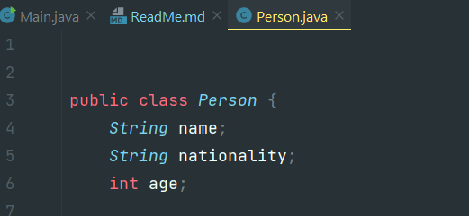
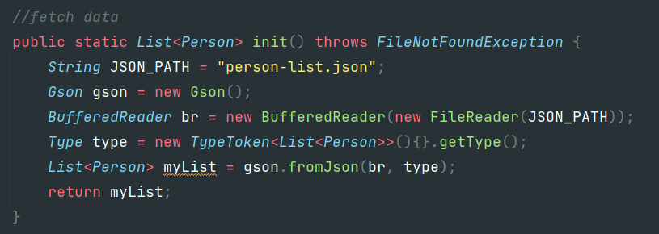
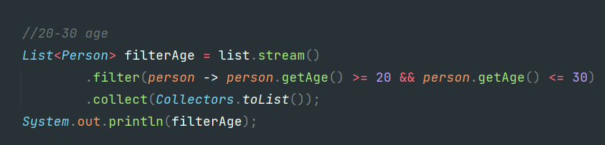
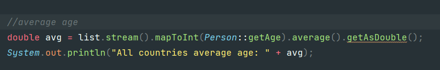
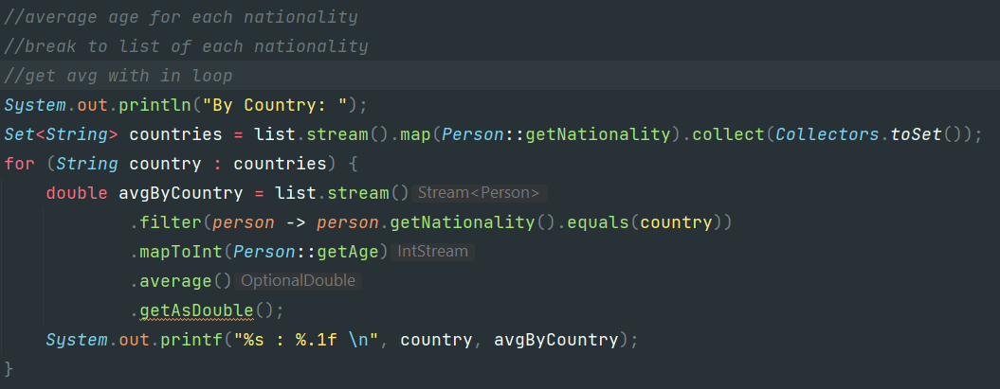

## Java Stream
#### Bước 1: Tạo class Person, đọc dữ liệu person từ file json và lưu vào List Person.

#### Bước 2: FilterList tuổi >=20 && <= 30 dùng stream().filter().collect() 

#### Bước 3: Lấy tuổi trung bình dùng mapToInt().average()

#### Bước 4: Lấy tuổi trung bình theo từng nước 
    - Set<String> filtered nationality từ list 
    - Filter.mapToInt().average() cho từng nationality

