## Cách làm:
- Tạo RestController RestBook để xử lí trả về json
- Tạo thêm BookService để xử lí logic, tránh trùng lặp code tại Controller
### Chuẩn bị
#### Cấu trúc thư mục
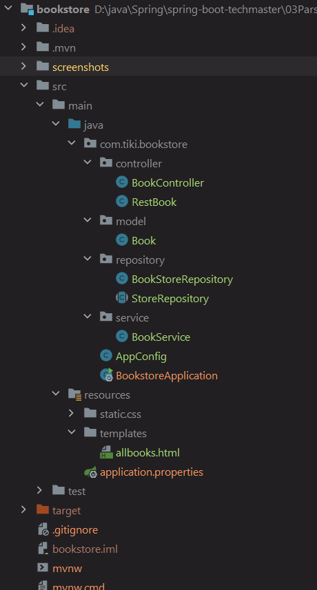
#### Tạo class BookService & thêm Bean ở AppConfig
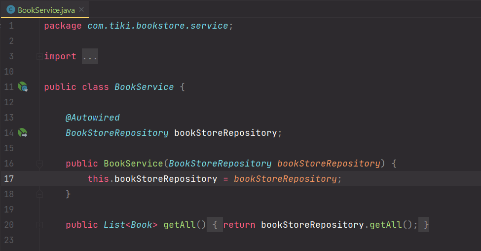
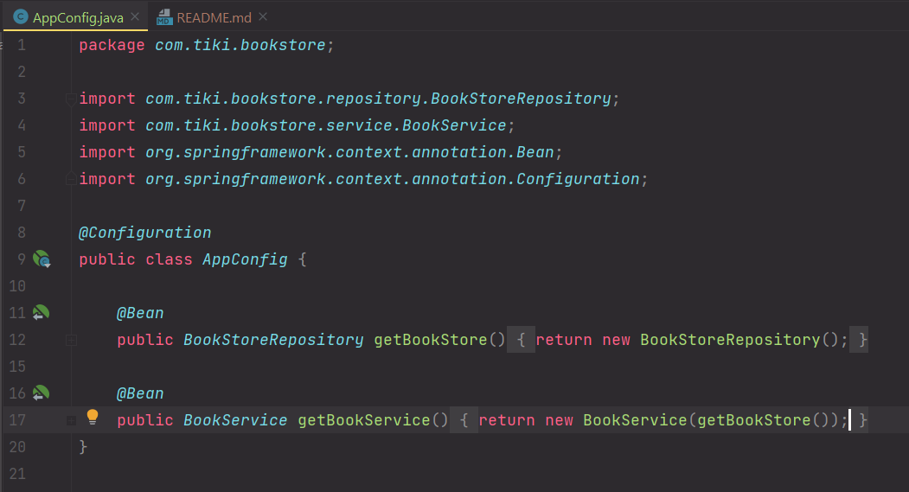

### GetMapping
1. Controller
- Autowire BookService
- Nhận id từ param và truyền xuống Service

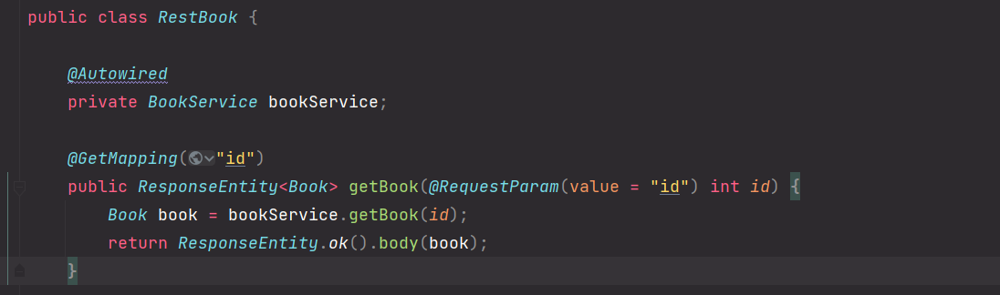
2. Service
- truyền xuống Repository và nhận về Optional Book
- Chuyển Optional<Book> về Book (nếu optional == null -> return null)

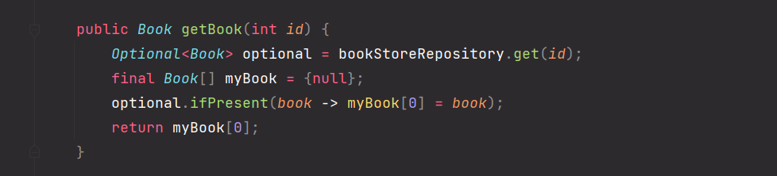
3. Repo
- Tìm Book bằng stream.filter (giả định là Id không trùng nhau)

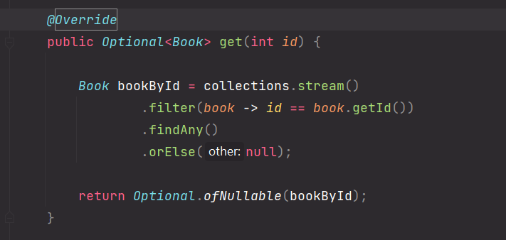
 
4. Test

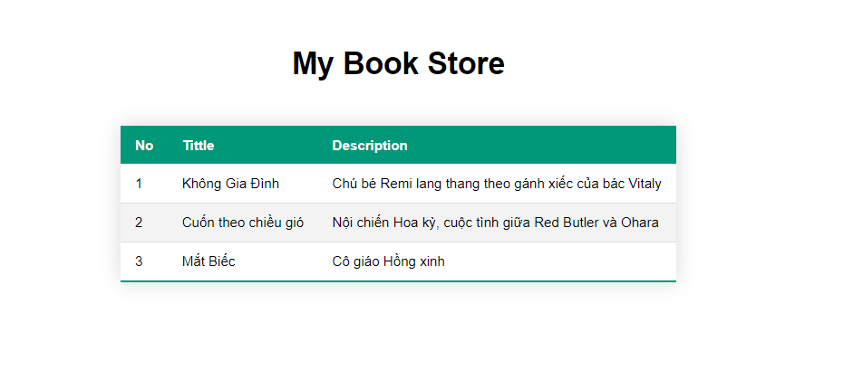
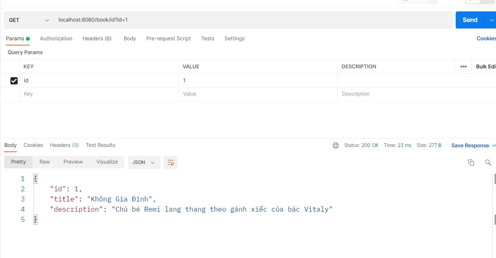
### PostMapping
1. Controller
- Nhận param id, title, description
- truyền xuống Service

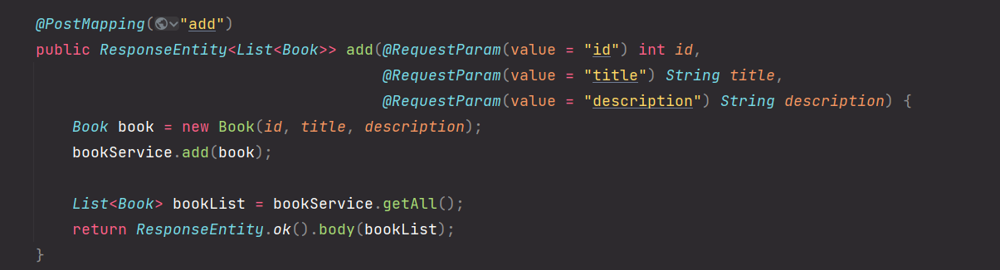
2. Service & Repo
- Thêm sách vào collection

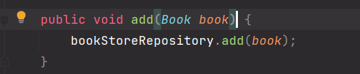

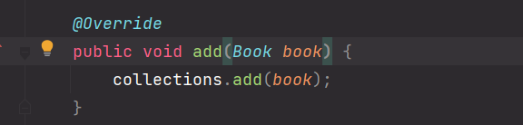
3. Test
  
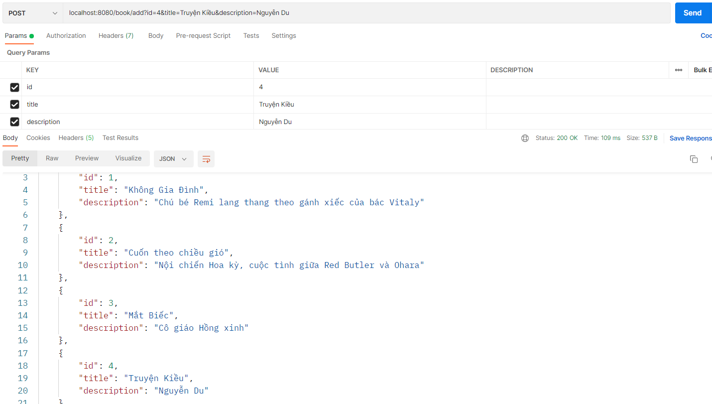

### PutMapping
1. Controller
- Nhận param id, title, description và truyền xuống Service 
- Trong trường hợp id chưa tồn tại thì ta sẽ tạo một Book mới

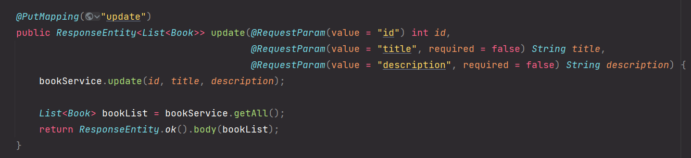
2. Service
- Tìm Book bằng id (hàm getBook)
- Update book tìm được (nếu trống trường nào thì ta để nguyên trường đó)
- Nếu không tìm được book => tạo book mới (hàm add(new Book))
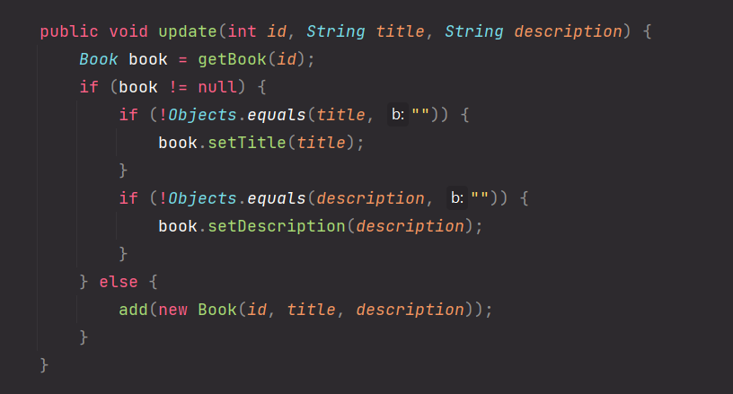
3. Test
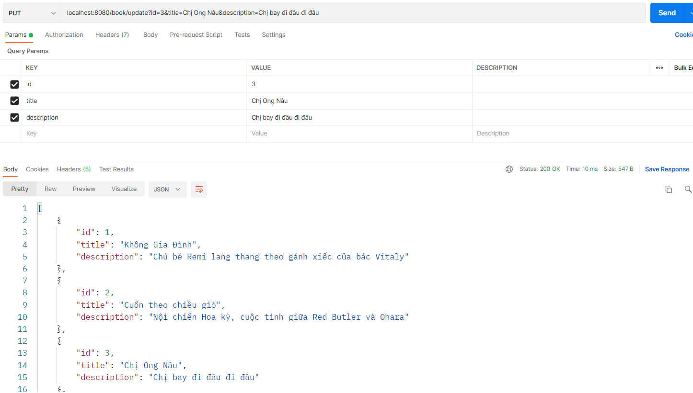
### DeleteMapping
1. Controller
- Nhận param id và truyền xuống Service

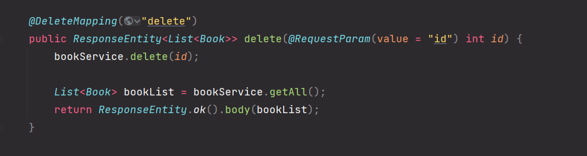
 
2. Service
- Tìm book bằng hàm getBook, nếu tìm được thì truyền xuống Repo xóa; nếu không tìm được thì không làm gì cả

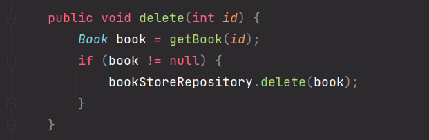
 
3. Repo
- Xóa khỏi collection

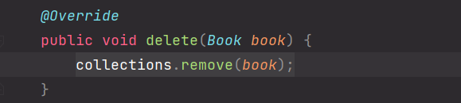
 
4. Test
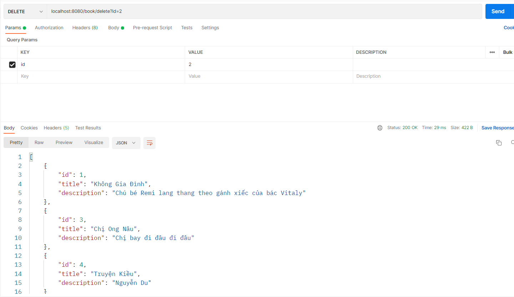

