## Thymeleaf render
### Project structure
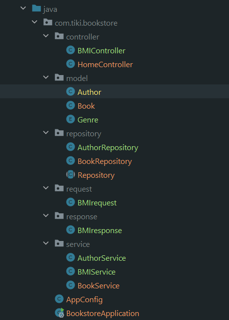
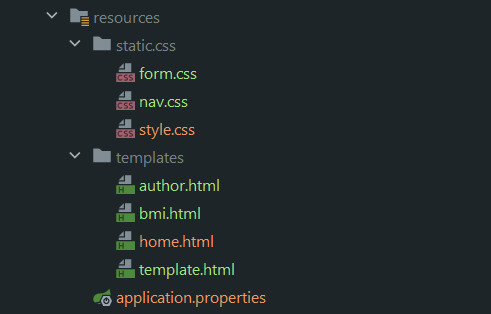
### th:fragment - dùng chung cho các trang html (Navbar, header, footer)
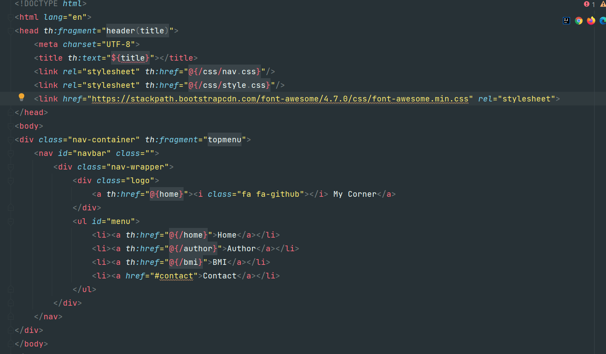
### th:each - Vòng lặp để lấy ra các item trong list, array; th:switch case để tùy chọn hiển thị dựa vào dữ liệu
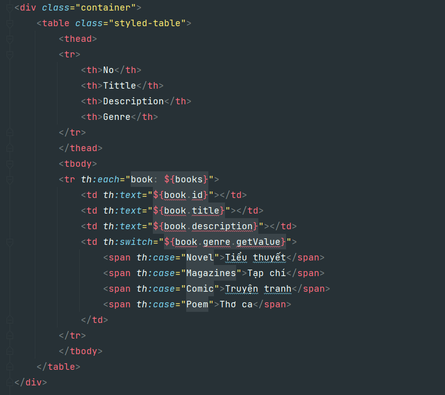
### th:if & th:unless - tùy chọn hiển thị trong 2 trường hợp
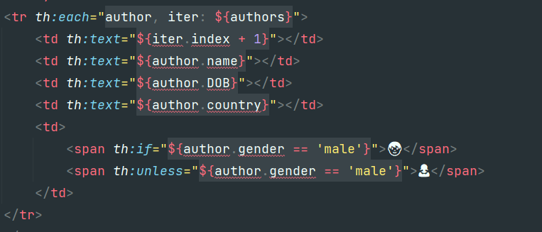
### th:action th:object method post - submit form -> postmapping
- HTML\
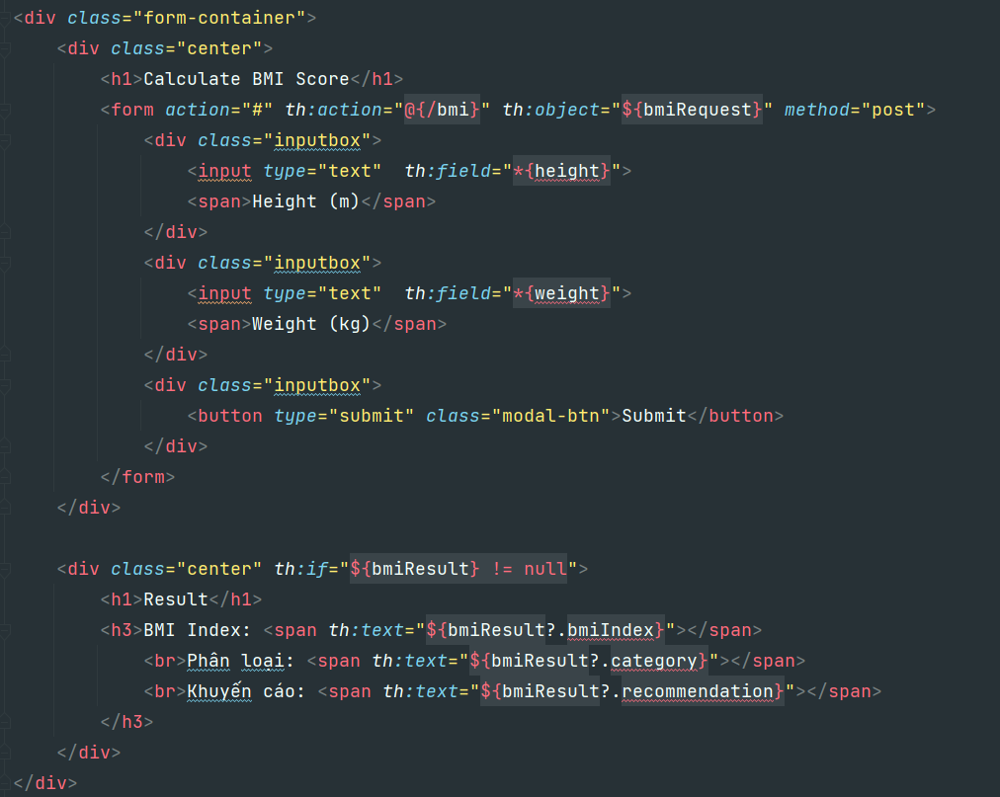

- Controller\
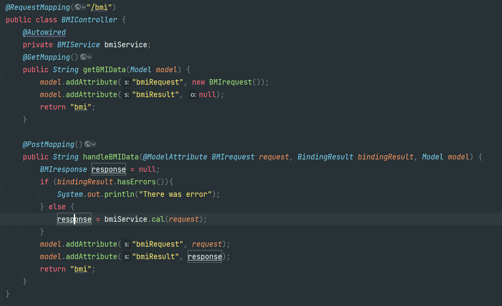

- Service\
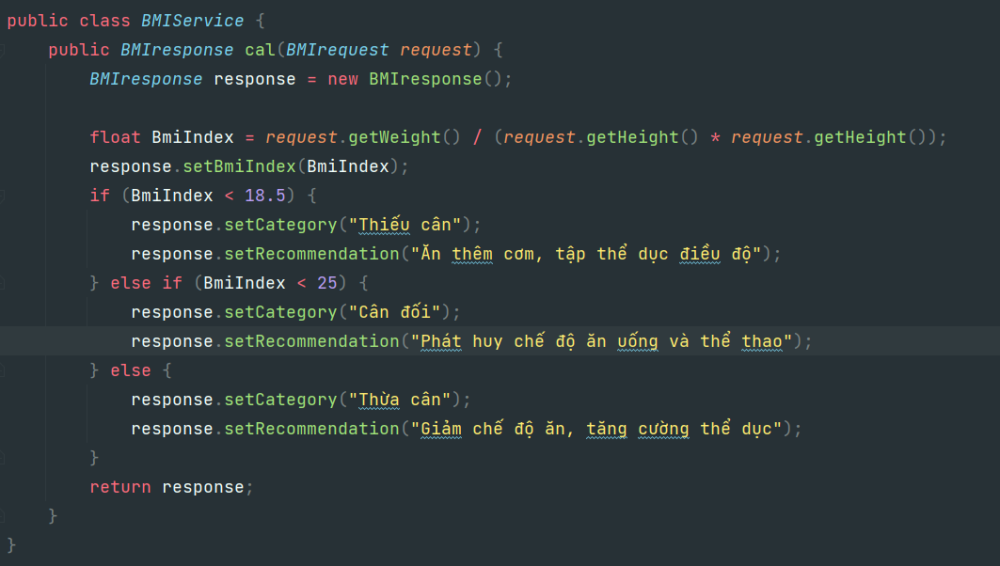

### Test
- Home\
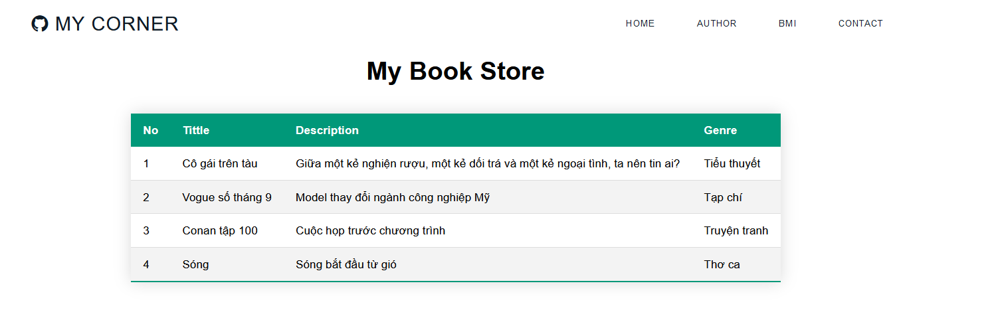
- Author\
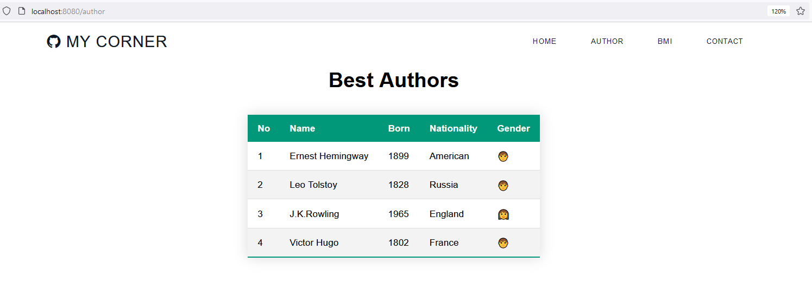
- Bmi - before\
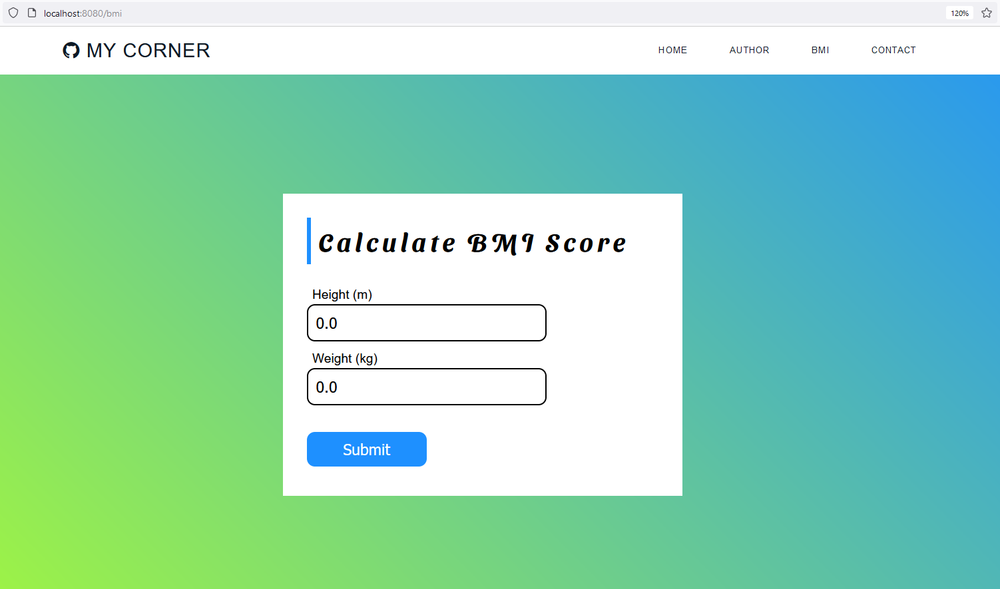
- Bmi - after\
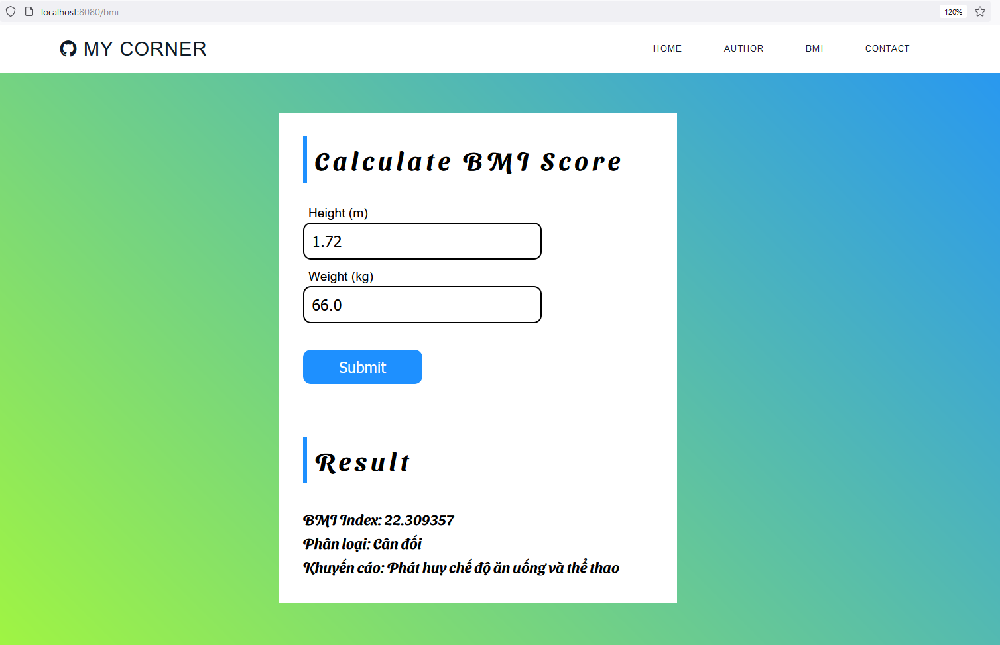

