## Car Thymleaf
### Lưu ý: 
- Project chỉ sort được list của tất cả car tại home.html
- Khi tìm bằng keyword ra list -> sort thì chưa làm được
- Project sử dụng bootstrap để tạo nav-bar, buttons & modal
### Project structure
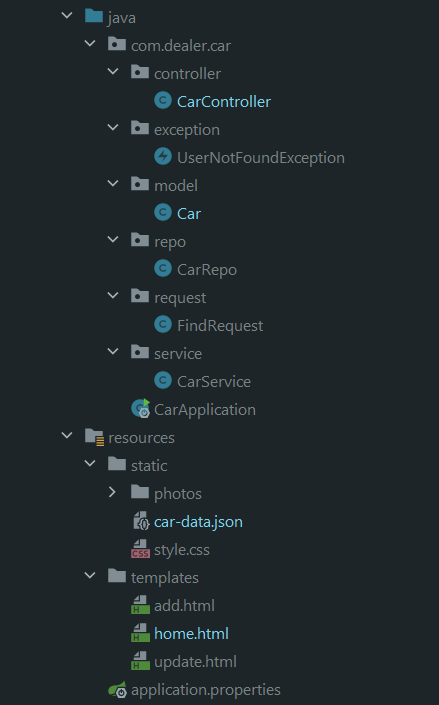
### Fetch data from json file
- Add dependency\
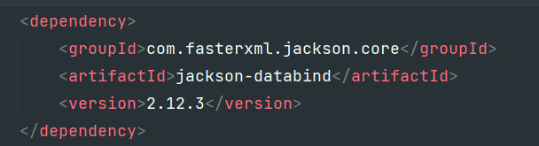
- Json File
  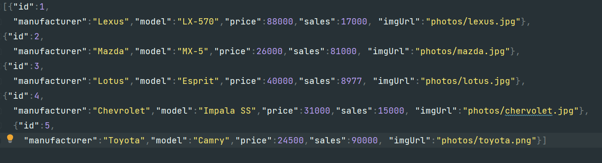
- Read data from json\
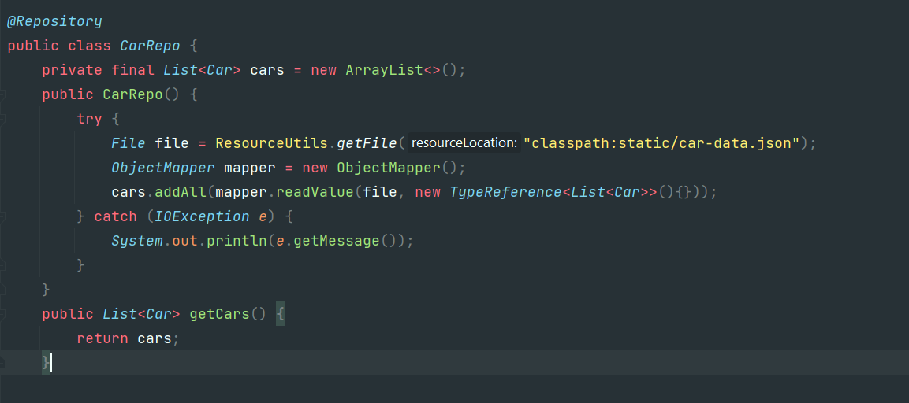
### GetMapping: Return List Car: All, Find by keyword, Sort By Price
- Ý tưởng: để hết trong home.html, tùy vào biến keyword/sort có được truyền vào không mà render ra list
  - Controller
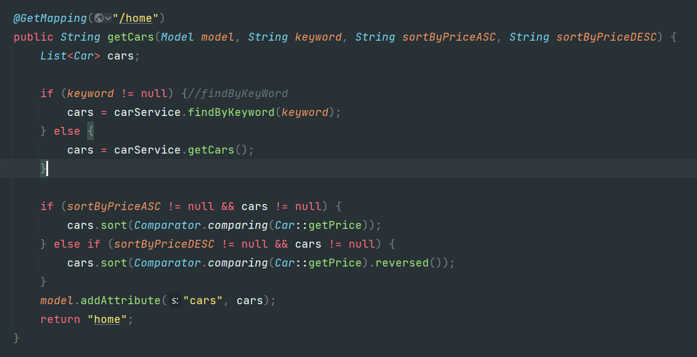
  - Repo (Thêm dependency commonlang để dùng StringUtils)
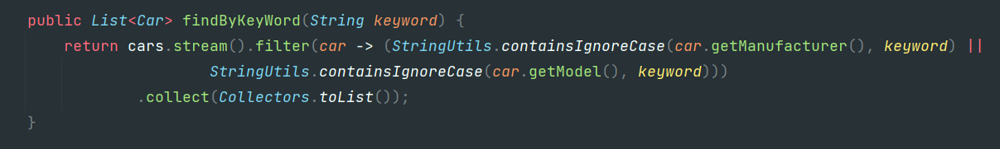
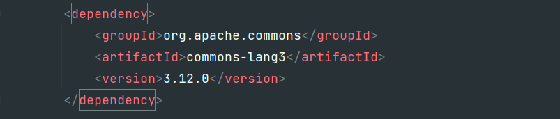
  - Thymeleaf
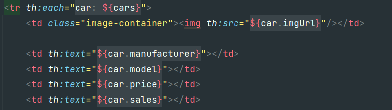
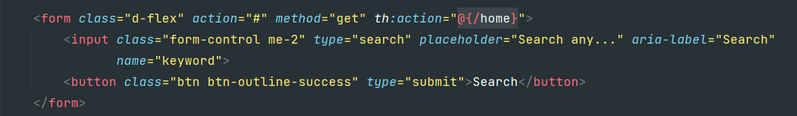
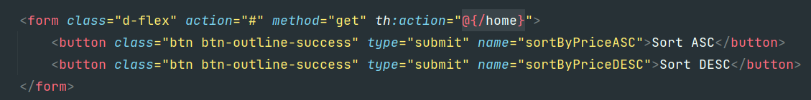
  - Test
    - home
  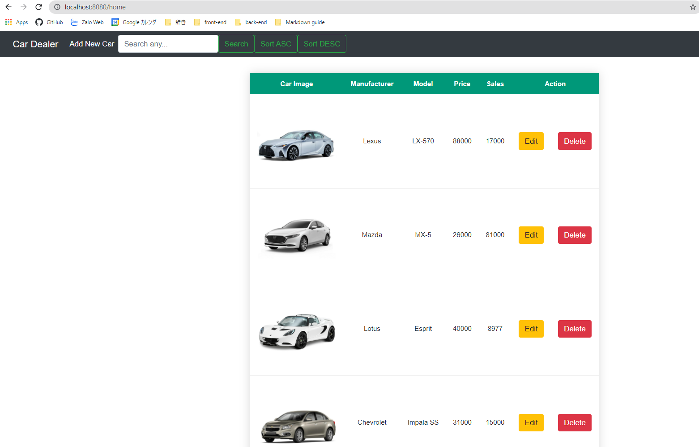
    - search
  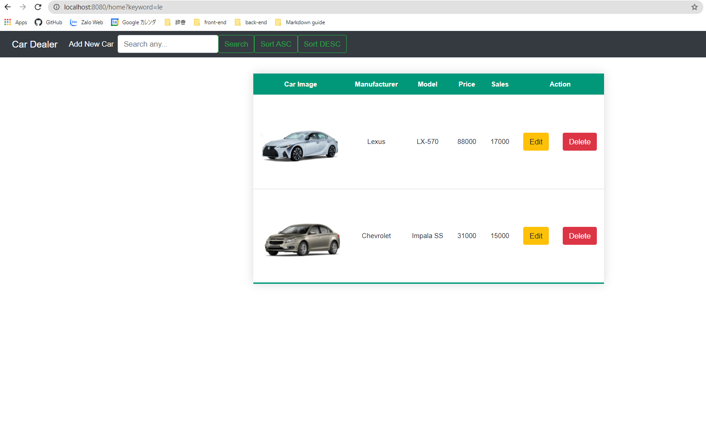
    - sort
  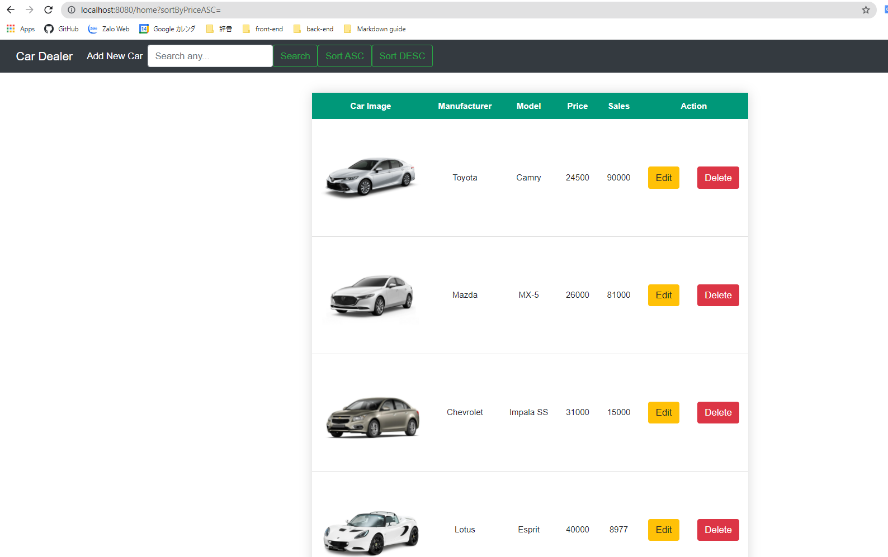
  
### PostMapping: Add new car - direct sang trang add (Không cho update id)
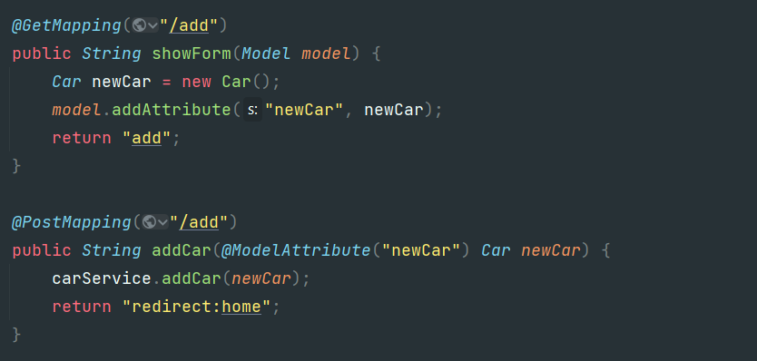
    (Service & Repo chỉ đơn giản là add vào list)
  - Thymeleaf: add link ở nav-bar
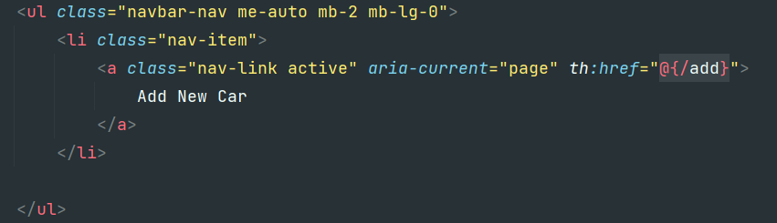
  - Test
    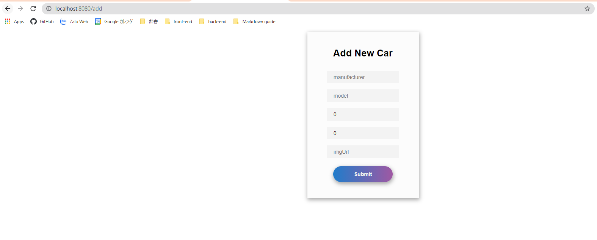
### Update car (dùng Get & Post (tương tự PutMapping))
- Controller
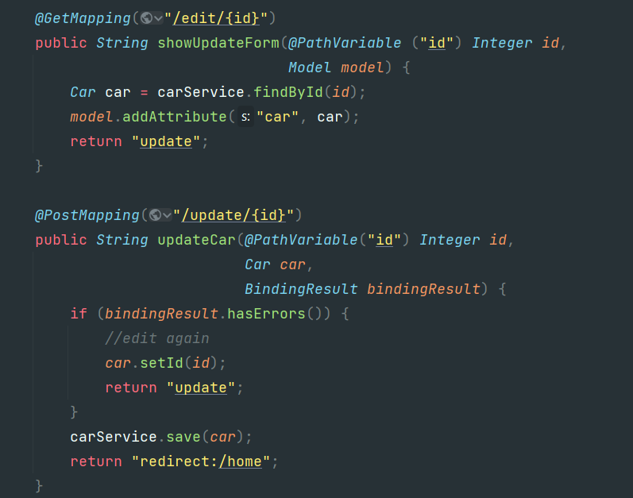
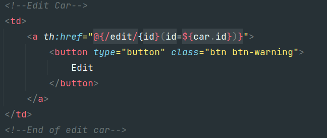
- update.html
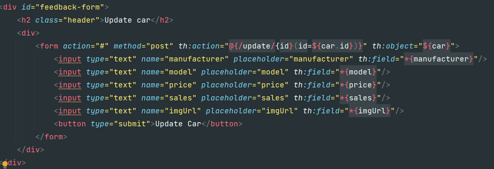
- Test
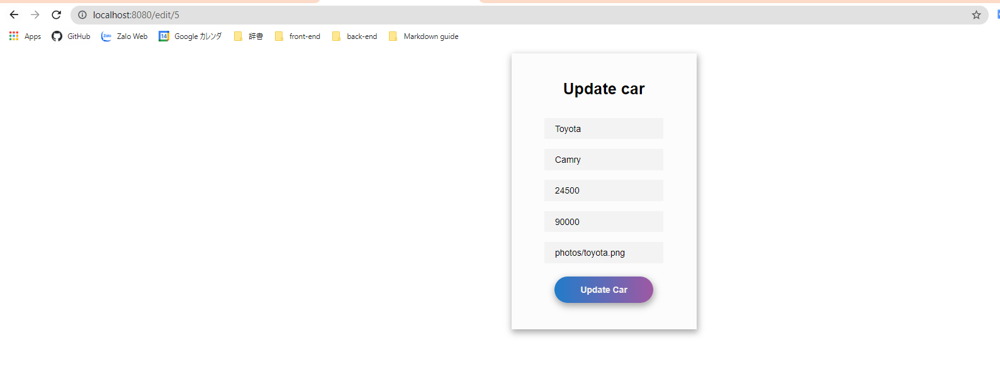
### Delete: dùng GetMapping delete và redirect lại home
> Thêm modal: modal xuất hiện để confirm xóa car
- Controller
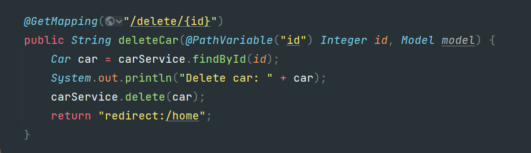
  (Service & Repo chỉ đơn giản là xóa đi)
- Thymeleaf:
  - Button toggle modal:
    - button
  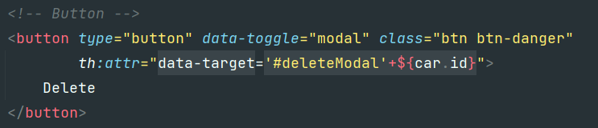
    - modal
  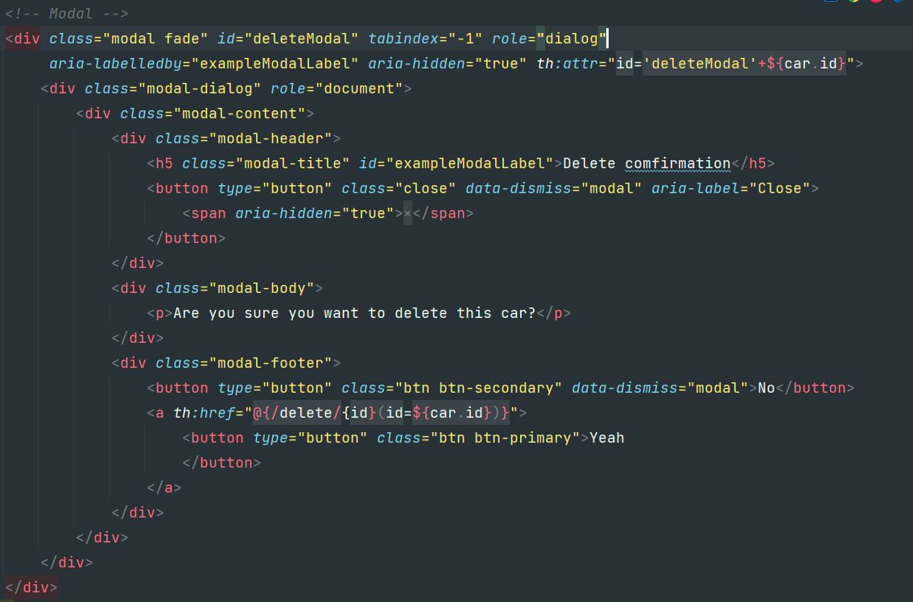
- Test: 
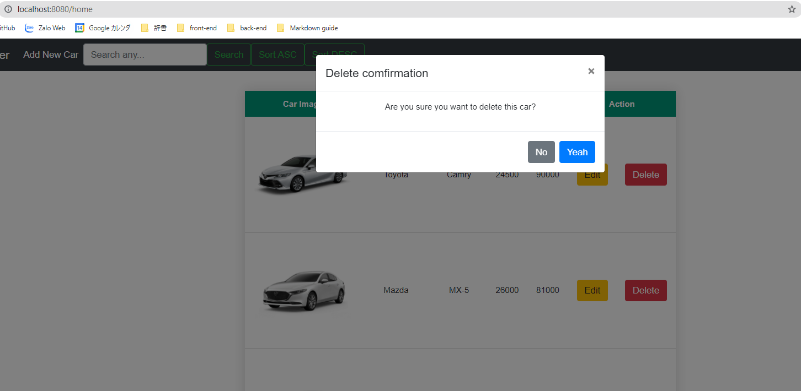
